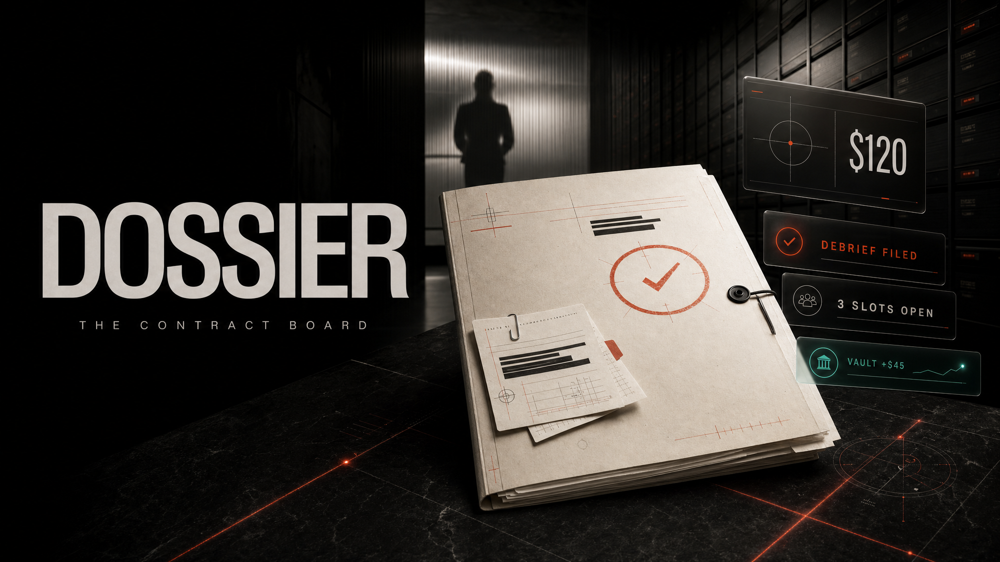

<p align="center">
  
</p>

<h1 align="center">Dossier</h1>
<p align="center">
  
  &nbsp;Built on Whop &nbsp;·&nbsp; The Contract Board
</p>

<p align="center">A task marketplace, restyled as a spy-noir contract board.<br />Handlers issue paid contracts, operatives accept and deliver, and every approval releases real money straight to the Vault.</p>

## Highlights

- **Native Whop UI** — built on frosted-ui, Whop's own design system, so every button, card, and badge is the real thing, not a lookalike.
- **One honest money loop** — claim → debrief → approve/decline → payout runs as a single atomic Postgres transaction, nothing mocked.
- **Two-sided demo, one browser** — a persona switcher lets you play handler and operative in the same tab, no auth required.

## Stack

Next.js 16 (App Router) · React 19 · frosted-ui · Tailwind CSS 4 · Supabase Postgres (`postgres.js`) · TypeScript

## Run it

```bash
pnpm install
echo "DATABASE_URL=postgresql://…" > .env.local
pnpm migrate && pnpm seed
pnpm dev
```

Open **http://localhost:3000** and switch personas from the navbar to play both sides.
